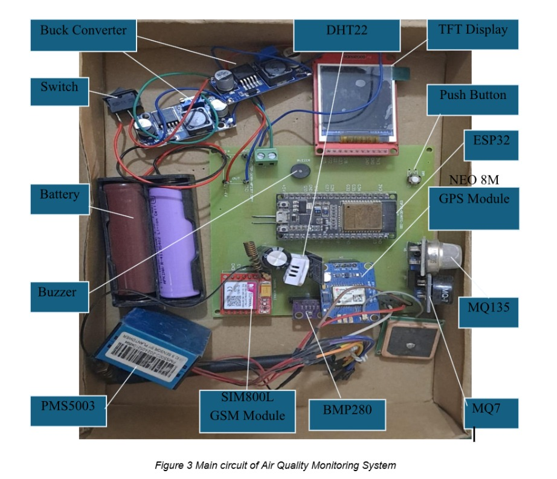
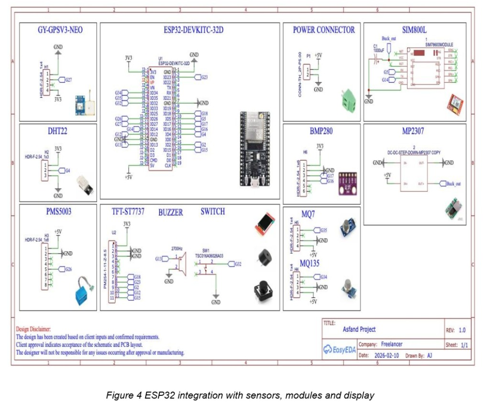
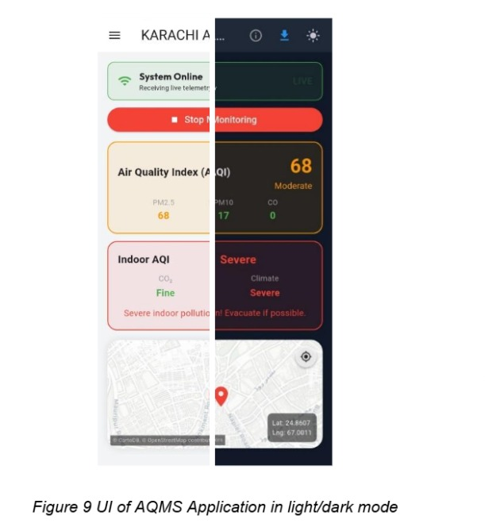
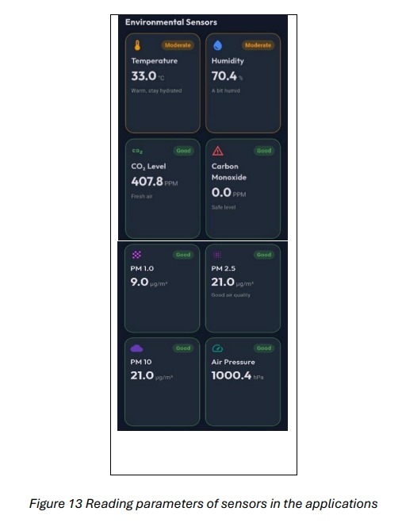
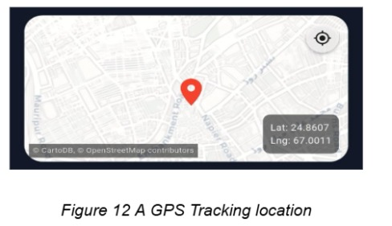
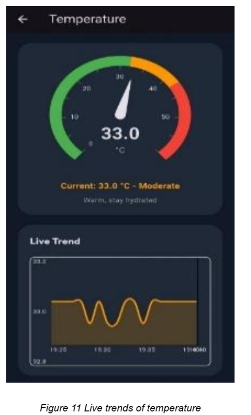
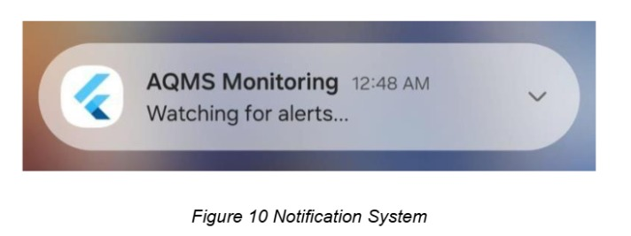
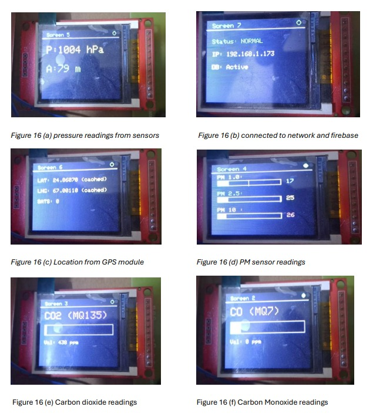
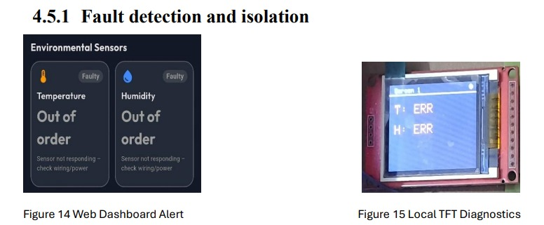
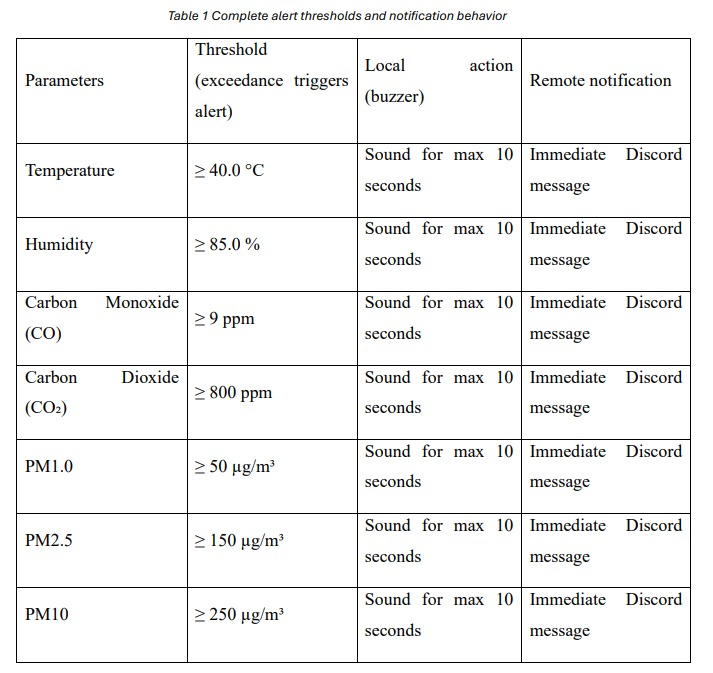

# AQMS – Air Quality Monitoring System

## 📌 Project Overview

AQMS (Air Quality Monitoring System) is an IoT-based environmental monitoring system developed using an ESP32 and multiple sensors.

The system collects environmental and air-quality data such as temperature, humidity, atmospheric pressure, carbon monoxide, air-quality measurements, and particulate matter. The collected data can be transmitted to Firebase and monitored through a Flutter mobile application.

The system also provides local display, alerts, notifications, GPS information, and offline data handling.

---------------------------------------------

## ✨ Features

* 🌡️ Temperature monitoring
* 💧 Humidity monitoring
* 🌤️ Atmospheric pressure monitoring
* 🏭 Carbon monoxide (CO) monitoring
* 🌫️ Air-quality / gas monitoring
* 🌁 PM1.0, PM2.5 and PM10 monitoring
* 📍 GPS location tracking
* 📺 TFT display for local monitoring
* ☁️ Firebase Realtime Database integration
* 📱 Flutter mobile application
* 🔔 Mobile notifications
* 🚨 Air-quality alerts
* 🔊 Buzzer alerts
* 💬 Discord notifications
* 📡 Wi-Fi connectivity
* 💾 Offline data buffering

---------------------------------------------

## 🏗️ System Architecture

```text
                    ┌──────────────────────┐
                    │       Sensors        │
                    │                      │
                    │ DHT  |  BMP280       │
                    │ MQ-7 |  MQ-135       │
                    │ PMS  |  GPS          │
                    └──────────┬───────────┘
                               │
                               ▼
                    ┌──────────────────────┐
                    │        ESP32         │
                    │                      │
                    │ Data Collection      │
                    │ Data Processing      │
                    │ Wi-Fi Communication  │
                    └──────────┬───────────┘
                               │
                               ▼
                    ┌──────────────────────┐
                    │       Firebase       │
                    │  Realtime Database   │
                    └──────────┬───────────┘
                               │
                               ▼
                    ┌──────────────────────┐
                    │   Flutter Mobile     │
                    │     Application      │
                    │                      │
                    │ Dashboard            │
                    │ Graphs               │
                    │ Notifications        │
                    │ Location             │
                    └──────────────────────┘
```

---------------------------------------------

## 🔧 Hardware

The main hardware components used in the system are:

| Component   | Purpose                                      |
| ----------- | -------------------------------------------- |
| ESP32       | Main microcontroller and Wi-Fi communication |
| DHT Sensor  | Temperature and humidity measurement         |
| BMP280      | Atmospheric pressure measurement             |
| MQ-7        | Carbon monoxide monitoring                   |
| MQ-135      | Air-quality / gas monitoring                 |
| PMS Sensor  | Particulate matter measurement               |
| GPS Module  | Location tracking                            |
| ST7735 TFT  | Local data display                           |
| Buzzer      | Local alerts                                 |
| Push Button | User input                                   |

---------------------------------------------

## 📊 Parameters Monitored

| Parameter                      | Source     |
| ------------------------------ | ---------- |
| Temperature                    | DHT Sensor |
| Humidity                       | DHT Sensor |
| Atmospheric Pressure           | BMP280     |
| CO                             | MQ-7       |
| Air Quality / Gas Measurements | MQ-135     |
| PM1.0                          | PMS Sensor |
| PM2.5                          | PMS Sensor |
| PM10                           | PMS Sensor |
| Latitude / Longitude           | GPS        |

---------------------------------------------

## 💻 Software & Technologies

### ESP32 Firmware

The ESP32 firmware is developed using the Arduino development environment and includes functionality for:

* Sensor data acquisition
* Data processing
* Wi-Fi connectivity
* Firebase communication
* Local TFT display
* GPS handling
* Alert generation
* Offline data handling
* Discord notifications

### Mobile Application

The mobile application is developed using:

* Flutter
* Dart
* Firebase
* Flutter Map
* FL Chart
* Firebase Cloud Messaging
* Local Notifications
* Background Services

---------------------------------------------

## 📱 Flutter Application

The Flutter application provides a mobile interface for monitoring the AQMS system.

The application is designed to provide:

* Real-time sensor information
* Data visualization
* Graphs and charts
* Air-quality monitoring
* GPS/map information
* Notifications
* Background monitoring
* Data export/sharing functionality

---------------------------------------------

## ☁️ Firebase

Firebase Realtime Database is used as the backend for storing and synchronizing sensor data.

The ESP32 sends sensor readings to Firebase, while the Flutter application retrieves the data and presents it to the user.

Private Firebase credentials and authentication information are **not included in this repository**.

---------------------------------------------

## 🚨 Alert System

AQMS includes an alert mechanism for monitored environmental parameters.

Depending on the configured thresholds, the system can provide:

* 🔊 Local buzzer alerts
* 📱 Mobile notifications
* 💬 Discord notifications

This allows the user to be informed when monitored values reach configured alert levels.

---------------------------------------------

## 💾 Offline Data Handling

The ESP32 includes offline data-handling functionality.

If network connectivity is unavailable, sensor readings can be handled through an offline queue and synchronized when connectivity becomes available again.

---------------------------------------------

## 📍 GPS Tracking

The system includes a GPS module to obtain geographical coordinates.

GPS information can be associated with sensor readings and used by the mobile application for location-based visualization.

---------------------------------------------

## 📷 Project Images

### Hardware Prototype


### ESP32 Integration with Sensors


### Flutter Application UI (Light & Dark Mode)


### Environmental Sensors Dashboard


### GPS Tracking Location


### Temperature Live Trends


### Notification System


### TFT Display Readings


### Fault Detection & Isolation


### Data Tables



---------------------------------------------

## ⚙️ Project Structure

```text
AQMS-Air-Quality-Monitoring-System/
│
├── README.md
├── .gitignore
│
├── ESP32_Firmware/
│   ├── AQMS_ESP32.ino
│   └── config.example.h
│
├── Flutter_App/
│   ├── lib/
│   │   ├── main.dart
│   │   └── background_service.dart
│   └── pubspec.yaml
│
├── Documentation/
│   ├── Main_Circuit_AQMS.jpeg
│   ├── ESP32_Integration_Sensors_Modules_Dis.jpeg
│   └── Project_Report.pdf
│
├── Images/
│   ├── AQMS_Aplication_Light_Dark.jpeg
│   ├── Environmental_Sensors.jpeg
│   ├── GPS_Tracking_Location.jpeg
│   ├── Temperature_Live_Trends.jpeg
│   ├── Notification_System.jpeg
│   ├── TFT_Display_Readings.jpeg
│   └── Fault_Detection.jpeg
│
└── Tables/
    ├── Evaluation_CO2_Temperature_Humidity.jpeg
    └── Alert_Thresholds_Notification_Behavior.jpeg
```

---------------------------------------------

## ⚙️ Setup

### ESP32

1. Install the Arduino IDE.
2. Install ESP32 board support.
3. Install the required libraries.
4. Open `AQMS_ESP32.ino`.
5. Create a private `config.h` file using `config.example.h` as a template.
6. Enter your own Wi-Fi and service credentials in `config.h`.
7. Upload the firmware to the ESP32.

> **Important:** `config.h` contains private configuration information and must not be uploaded to GitHub.

Required Arduino Libraries:
- Adafruit GFX Library
- Adafruit ST7735 and ST7789 Library
- DHT sensor library (by Adafruit)
- Adafruit BMP280 Library
- TinyGPSPlus
- PMS Library (by fu-hsi)
- ArduinoJson (version 6.x)
- Firebase ESP32 Client

Board Support:
Install ESP32 boards (via Boards Manager) and select your ESP32 model.

### Flutter Application

1. Install the Flutter SDK.
2. Install Android Studio or another supported Flutter development environment.
3. Open the `Flutter_App` directory.
4. Install the required Flutter dependencies.
5. Configure Firebase for your own project.
6. Run the Flutter application on a supported Android device or emulator.

Required Flutter Dependencies (add to `pubspec.yaml`):
`flutter_map`
`latlong2`
`google_fonts`
`flutter_animate`
`overlay_support`
`path_provider`
`share_plus`
`csv`
`fl_chart`
`syncfusion_flutter_gauges`
`firebase_core`
`firebase_database`
`connectivity_plus`
`flutter_local_notifications`
`firebase_messaging`
`flutter_background_service`

Firebase Setup:
1. Create a Firebase project and add an Android app (package name e.g., `com.example.aqms`).
2. Download `google-services.json` into `android/app/`.
3. Enable Realtime Database (set rules to allow read/write as needed).

Android-specific requirements:
- `minSdkVersion ≥ 21` (or 23 for foreground service types)
- Add to `AndroidManifest.xml`:
  - Permissions: `INTERNET`, `FOREGROUND_SERVICE`, `FOREGROUND_SERVICE_DATA_SYNC`

---------------------------------------------

## 🔒 Security

This repository intentionally does not contain private credentials.

Do not upload:

* Wi-Fi passwords
* Firebase secrets
* API keys
* Private tokens
* Webhook credentials
* Private certificates
* `.env` files containing secrets

Use the provided example configuration files instead.

---------------------------------------------

## 🔮 Future Improvements

Potential future improvements include:

* Improved sensor calibration
* Additional environmental sensors
* Improved air-quality analysis
* More detailed historical data analysis
* Advanced notification rules
* Improved mobile application features
* Cloud-based analytics
* Machine-learning-based air-quality prediction

---------------------------------------------

## 👨‍💻 Author

Muhammad Rafay Ali Khan

Electronics Engineering Student

### Technologies

`ESP32` · `Arduino` · `C++` · `Flutter` · `Dart` · `Firebase` · `IoT` · `Embedded Systems`
